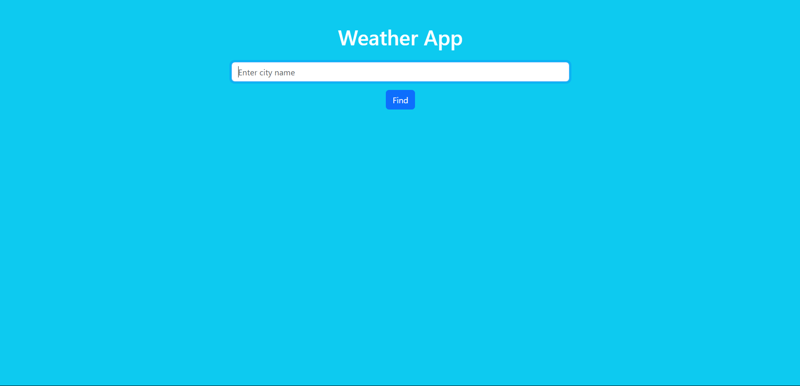
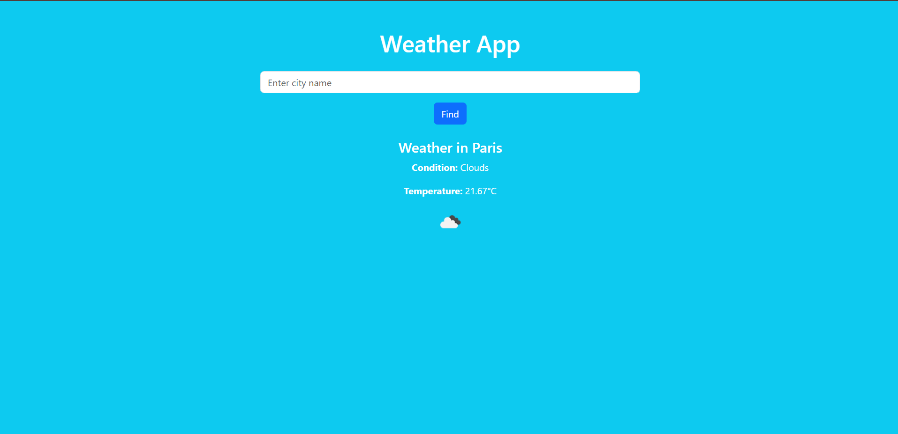
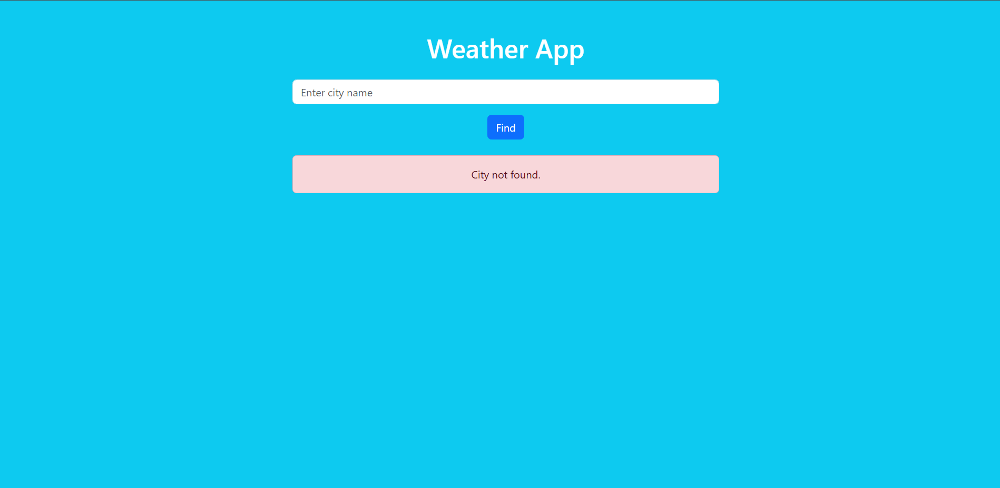

# Flask Weather App with OpenWeatherMap API

A simple and elegant Flask web application to display real-time weather information for any city using the OpenWeatherMap API. 

## Features

- Search for any city and get:
- Current weather description
- Temperature in Celsius
- Weather icon
- Uses OpenWeatherMap API
- Secure API key handling with `.env`
- Jinja2 templating and clean UI

## Tech Stack

| Layer         | Technology            |

| Backend       | Python 3.10+, Flask   |
| API           | OpenWeatherMap        |
| Secrets       | python-dotenv         |
| UI Template   | HTML + Jinja2         |
| HTTP Client   | requests               |

## Setup Instructions

## 1️ Clone the Repository

bash
git clone https://github.com/YOUR_USERNAME/weather-app.git
cd weather-app

## 2 Create a Virtual Environment

python -m venv venv
source venv/bin/activate       

## 3️ Install Requirements

pip install -r requirements.txt

## 4️ Create .env File

OPENWEATHER_API_KEY=your_api_key_here
Get a free key at https://openweathermap.org/api

## 5  Run the App
python app.py

## Screenshots ##

## Weather App

## Weather of City

## Weather of City -Error

License
MIT © Abhishek Sahukar

If you like this project or want to contribute, feel free to fork and open a PR!
